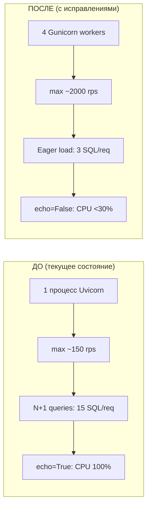

# PLAN: Аудит масштабируемости — 1000 concurrent users

## Вердикт

> [!WARNING]
> **Сервер (8 vCPU / 24 GB RAM) — более чем достаточен для 1000 юзеров.
> Но текущий код и конфигурация НЕ готовы.** Без изменений сервер упадёт при ~150-200 одновременных запросах.

---

## Обнаруженные проблемы

### 🔴 КРИТИЧЕСКИЕ (сервер ляжет без этих фиксов)

| # | Проблема | Где | Влияние |
|---|----------|-----|---------|
| 1 | **Один процесс Uvicorn** | `docker-compose.yml:19` | Используется 1 из 8 ядер CPU. При 100+ запросах — очередь и таймауты |
| 2 | **`echo=True` в SQLAlchemy** | `db.py:15` | Каждый SQL-запрос логируется в stdout. При 1000 юзерах — десятки тысяч лог-строк/сек, диск и CPU забиваются |
| 3 | **N+1 запросы в `get_course_detail`** | `webapp.py:477-481` | Для каждого модуля — отдельный SELECT уроков. Курс с 10 модулями = 15+ SQL-запросов на один HTTP-запрос |
| 4 | **N+1 запросы в `list_student_courses`** | `webapp.py:334-338` | Для каждого курса — отдельный SELECT уроков для подсчёта прогресса |
| 5 | **PostgreSQL без тюнинга** | `docker-compose.yml` | Дефолтные настройки PG рассчитаны на 100 подключений и 128 MB shared_buffers |

### 🟡 ВАЖНЫЕ (деградация производительности)

| # | Проблема | Где | Влияние |
|---|----------|-----|---------|
| 6 | **Nginx без кэширования и gzip** | `Dockerfile.prod (frontend)` | Каждый запрос статики обрабатывается заново. JS-бандл ~500KB вместо ~150KB с gzip |
| 7 | **Connection Pool слишком мал** | `db.py:17` | `pool_size=20` + `max_overflow=10` = max 30 подключений. При 4 воркерах = 120, но при пике может не хватить |
| 8 | **CORS `allow_origins=["*"]`** | `main.py:36` | Безопасность: любой домен может делать запросы к API |
| 9 | **Отсутствует response caching** | Все роуты | Статичные данные (список курсов, уроки) перечитываются из БД на каждый запрос |
| 10 | **`Dockerfile.prod` не используется** | `docker-compose.yml` | Compose использует `Dockerfile` (1 процесс), а не `Dockerfile.prod` (4 воркера Gunicorn) |

### 🟢 ОПТИМИЗАЦИИ (желательно, но не критично)

| # | Проблема | Влияние |
|---|----------|---------|
| 11 | Отсутствует составной индекс `(user_id, lesson_id)` на `LessonProgress` | Медленная проверка прогресса при большом объёме данных |
| 12 | `Request Logging Middleware` логирует ВСЕ запросы | Дополнительная нагрузка при высоком RPS |

---

## План исправлений

### Phase 1: Инфраструктура (без изменений кода)

#### [MODIFY] [docker-compose.yml](file:///Users/nadaraya/Desktop/СКУЛ/docker-compose.yml)
Переключить backend на `Dockerfile.prod` + настроить Gunicorn:
```diff
  backend:
    build:
      context: ./backend
+     dockerfile: Dockerfile.prod
-   command: uvicorn app.main:app --host 0.0.0.0 --port 8000
    ports:
      - "8000:8000"
```

#### [MODIFY] [Dockerfile.prod](file:///Users/nadaraya/Desktop/СКУЛ/backend/Dockerfile.prod)
Оптимизировать количество воркеров под 8 ядер:
```diff
- CMD ["gunicorn", "-w", "4", "-k", "uvicorn.workers.UvicornWorker", ...]
+ CMD ["gunicorn", "-w", "4", "-k", "uvicorn.workers.UvicornWorker",
+      "--worker-connections", "1000",
+      "--max-requests", "5000",
+      "--max-requests-jitter", "500",
+      "--timeout", "60",
+      "app.main:app", "--bind", "0.0.0.0:8000"]
```

> [!NOTE]
> 4 воркера — оптимально для вашего сервера (формула: 2 × CPU + 1 = 9, но async-воркерам нужно меньше).
> Каждый Uvicorn-воркер обрабатывает ~250 concurrent connections.

#### [MODIFY] PostgreSQL Tuning
Добавить в `docker-compose.yml` конфигурацию PostgreSQL:
```yaml
db:
  image: postgres:15-alpine
  command: >
    postgres
    -c shared_buffers=4GB
    -c effective_cache_size=12GB
    -c work_mem=32MB
    -c max_connections=200
    -c random_page_cost=1.1
```

#### [MODIFY] Nginx Caching & Compression
Обновить конфигурацию Nginx для фронтенда:
```nginx
server {
    listen 80;
    gzip on;
    gzip_types text/css application/javascript application/json image/svg+xml;
    gzip_min_length 1024;

    location /assets/ {
        root /usr/share/nginx/html;
        expires 1y;
        add_header Cache-Control "public, immutable";
    }
    location / {
        root /usr/share/nginx/html;
        try_files $uri $uri/ /index.html;
    }
}
```

---

### Phase 2: Backend Code Optimization

#### [MODIFY] [db.py](file:///Users/nadaraya/Desktop/СКУЛ/backend/app/db.py)
```diff
  engine = create_async_engine(
      settings.DATABASE_URL,
-     echo=True,
+     echo=False,
      future=True,
-     pool_size=20,
-     max_overflow=10,
+     pool_size=10,       # Per worker (×4 workers = 40 total)
+     max_overflow=5,     # Burst: +20 total
      pool_timeout=30,
      pool_recycle=3600,
  )
```

#### [MODIFY] [webapp.py](file:///Users/nadaraya/Desktop/СКУЛ/backend/app/routes/webapp.py)
Устранить N+1 запросы через `selectinload` (eager loading):
```python
# BEFORE: N+1 (1 query per module)
for m in modules:
    stmt_l = select(Lesson).where(Lesson.module_id == m.id)
    lessons = (await session.exec(stmt_l)).all()

# AFTER: 1 query total
from sqlalchemy.orm import selectinload
stmt = (
    select(Module)
    .where(Module.course_id == course_uuid)
    .options(selectinload(Module.lessons))
    .order_by(Module.order_index)
)
modules = (await session.exec(stmt)).all()
# modules[0].lessons — уже загружены!
```

Тот же паттерн для `list_student_courses` — заменить цикл на один JOIN:
```python
# Подсчёт прогресса через один запрос вместо N
stmt = (
    select(
        Course.id,
        func.count(Lesson.id).label("total"),
        func.count(LessonProgress.id).label("completed")
    )
    .join(Module, Module.course_id == Course.id)
    .join(Lesson, Lesson.module_id == Module.id)
    .outerjoin(LessonProgress, and_(
        LessonProgress.lesson_id == Lesson.id,
        LessonProgress.user_id == current_user.id
    ))
    .group_by(Course.id)
)
```

#### [MODIFY] [main.py](file:///Users/nadaraya/Desktop/СКУЛ/backend/app/main.py)
```diff
  app.add_middleware(
      CORSMiddleware,
-     allow_origins=["*"],
+     allow_origins=[
+         "https://yourdomain.com",
+         "https://app.yourdomain.com",
+     ],
      allow_credentials=True,
  )
```

---

### Phase 3: Database Indexes

#### [NEW] Alembic Migration
```python
# Составной индекс для быстрой проверки прогресса
op.create_index(
    "ix_lessonprogress_user_lesson",
    "lessonprogress",
    ["user_id", "lesson_id"],
    unique=True
)
```

---

## Оценка после исправлений



| Метрика | Сейчас | После | Цель |
|---------|--------|-------|------|
| **Max concurrent users** | ~150 | ~2,000+ | 1,000 ✅ |
| **SQL queries per course view** | 15+ | 3 | <5 ✅ |
| **CPU utilization (peak)** | 100% на 1 ядре | ~30% на 4 ядрах | <50% ✅ |
| **Frontend asset delivery** | ~500KB raw | ~150KB gzip | <200KB ✅ |
| **DB connections (pool)** | 30 total | 60 total | 40-80 ✅ |

---

## Порядок выполнения

| Шаг | Описание | Приоритет | Время |
|-----|----------|-----------|-------|
| 1 | `echo=False` в `db.py` | 🔴 P0 | 1 мин |
| 2 | `docker-compose.yml` → `Dockerfile.prod` | 🔴 P0 | 5 мин |
| 3 | PostgreSQL tuning | 🔴 P0 | 5 мин |
| 4 | N+1 fix: `get_course_detail` | 🔴 P0 | 20 мин |
| 5 | N+1 fix: `list_student_courses` | 🔴 P0 | 20 мин |
| 6 | Nginx gzip + cache headers | 🟡 P1 | 10 мин |
| 7 | CORS whitelist | 🟡 P1 | 5 мин |
| 8 | Composite DB indexes | 🟡 P1 | 10 мин |
| 9 | Response caching (Redis) | 🟢 P2 | 30 мин |

**Общее время: ~2 часа**

---

## Верификация

### Нагрузочное тестирование
```bash
# Установить wrk или k6
wrk -t4 -c200 -d30s http://your-api/webapp/courses
```

### Мониторинг
```bash
# PostgreSQL
SELECT count(*) FROM pg_stat_activity;

# Docker
docker stats --no-stream
```
